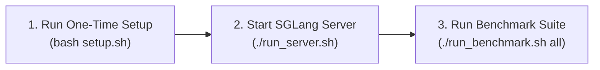
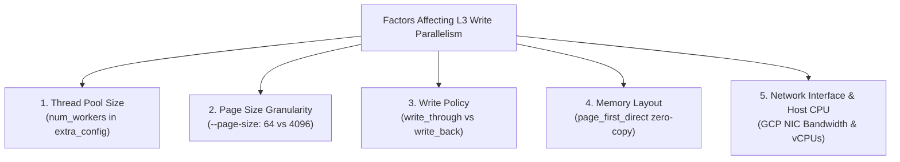

# SGLang HiCache: GCS Rapid Bucket KV-Cache Offload & Benchmark Guide

This document details the complete step-by-step reproduction instructions, environmental setup, server configuration flags, bucket hierarchy, exact token mathematical breakdown, and live empirical benchmark results across 16K, 32K, 64K, and 128K token scales using SGLang's Hierarchical KV Cache (HiCache) with Google Cloud Storage (GCS) Rapid Bucket as an L3 storage tier.

---

## 1. Quick Start: Exact Step-by-Step Reproduction

Follow these 3 simple steps to setup and benchmark GCS Rapid Bucket KV cache offloading from scratch:



### Step 1: Run One-Time Environment Setup
Run `setup.sh` once to configure the virtual environment, install PyTorch CUDA, pre-compiled SGLang binaries, GCS dependencies (`gcsfs`, `fsspec`), and link the local development tree:

```bash
cd ~/sglang
bash setup.sh
```

### Step 2: Start the SGLang Server
In your first terminal or tmux session, launch the SGLang server configured with the GCS Rapid Bucket offloader:

```bash
cd ~/sglang
./run_server.sh
```
*Wait until you see `INFO: Application startup complete` and `The server is fired up and ready to roll!`.*

### Step 3: Run the Benchmark Suite
In a second terminal or tmux session, run the automated benchmark runner:

```bash
cd ~/sglang

# Run all token scales (16K, 32K, 64K, 128K):
./run_benchmark.sh all

# Or run individual scales:
./run_benchmark.sh 16k
./run_benchmark.sh 32k
./run_benchmark.sh 64k
./run_benchmark.sh 128k
```

---

## 2. Environmental Details

### Hardware Specifications
- **GPU**: $1 \times$ NVIDIA H100 80GB HBM3
  - **Total VRAM**: 81,559 MiB (80 GB)
  - **Memory Bandwidth**: ~3.35 TB/s
  - **Driver Version**: `580.173.02`
- **Host CPU**: Intel(R) Xeon(R) Platinum 8481C CPU @ 2.70GHz (26 vCPUs)
- **Host RAM**: 230 GiB DDR5 System Memory
- **Operating System**: Linux (Ubuntu 22.04.1 LTS, Kernel `6.8.0-1066-gcp`, `x86_64`)

### Software & Model Specifications
- **Inference Engine**: SGLang (with FlashInfer and FlashAttention-3 backends)
- **Python Environment**: Python 3.10.12 virtualenv (`/home/princer_google_com/sglang/.venv`)
- **PyTorch / CUDA**: PyTorch 2.5+, CUDA 12.4
- **Model**: [`Qwen/Qwen2.5-0.5B-Instruct`](https://huggingface.co/Qwen/Qwen2.5-0.5B-Instruct)
  - **Checkpoint Snapshot**: `7ae557604adf67be50417f59c2c2f167def9a775`
  - **Served Model Name**: `Qwen2.5-0.5B-Instruct`
  - **Native Max Context**: 32,768 tokens
  - **Serving Context Length**: 135,000 tokens (enabled via `SGLANG_ALLOW_OVERWRITE_LONGER_CONTEXT_LEN=1`)
  - **Attention Backend**: `fa3` (FlashAttention-3)

---

## 3. Server Launch Script & Flag Reference

### Server Script (`run_server.sh`)

```bash
#!/usr/bin/env bash
cd ~/sglang

export PYTHONPATH=$PWD/python:$PYTHONPATH
export GOOGLE_APPLICATION_CREDENTIALS=/home/princer_google_com/.config/gcloud/application_default_credentials.json
export SGLANG_ALLOW_OVERWRITE_LONGER_CONTEXT_LEN=1
export HF_HUB_OFFLINE=1
export TRANSFORMERS_OFFLINE=1

source .venv/bin/activate

# Free port 30000 if previously occupied
fuser -k 30000/tcp 2>/dev/null || true

python3 -m sglang.launch_server \
  --model-path /home/princer_google_com/.cache/huggingface/hub/models--Qwen--Qwen2.5-0.5B-Instruct/snapshots/7ae557604adf67be50417f59c2c2f167def9a775 \
  --served-model-name Qwen2.5-0.5B-Instruct \
  --tp 1 \
  --host 0.0.0.0 \
  --port 30000 \
  --context-length 135000 \
  --mem-fraction-static 0.80 \
  --enable-hierarchical-cache \
  --page-size 4096 \
  --hicache-size 15 \
  --hicache-mem-layout page_first_direct \
  --hicache-io-backend direct \
  --hicache-write-policy write_through \
  --hicache-storage-backend gcs \
  --hicache-storage-prefetch-policy wait_complete \
  --hicache-storage-backend-extra-config '{"protocol": "gcs", "bucket": "princer-rapid-uscentral1a", "prefix": "sglang_kv_cache", "num_workers": 64, "metadata_ttl": 300}'
```

---

### Command-Line Arguments Breakdown

| Flag | Value Used | Default Value | Available Choices / Options | Detailed Description |
| :--- | :--- | :--- | :--- | :--- |
| `--model-path` | *Path to model snapshot* | *None (Required)* | Any local path or HuggingFace repo ID | Filesystem path or HuggingFace hub model ID of the weights to load. |
| `--served-model-name` | `Qwen2.5-0.5B-Instruct` | Derived from path | Any string | Clean model alias used for API endpoints and GCS storage key paths. |
| `--host` | `0.0.0.0` | `127.0.0.1` | `0.0.0.0`, `127.0.0.1`, IP string | Network IP address to bind the HTTP / FastAPI server. |
| `--port` | `30000` | `30000` | `1` – `65535` | TCP port on which the HTTP server listens for requests. |
| `--context-length` | `135000` | `32768` (from model) | Any integer $> 0$ | Maximum allowed token sequence length. Setting above model default requires `SGLANG_ALLOW_OVERWRITE_LONGER_CONTEXT_LEN=1`. |
| `--mem-fraction-static` | `0.80` | `0.85` | `0.1` – `0.95` | Fraction of total GPU VRAM reserved for static KV cache. `0.80` leaves ~13 GB for CUDA graph prefill captures. |
| `--enable-hierarchical-cache` | `True` | `False` | `True` (flag present), `False` | Master switch enabling multi-tier Hierarchical KV Cache (L1 GPU HBM $\to$ L2 Host RAM $\to$ L3 Storage). |
| `--page-size` | `4096` | `1` (token-level) | `1`, `64`, `512`, `4096` | Number of tokens per KV cache page block. `1` = 12 KB/file, `64` = 768 KB/file, `4096` = 48 MB/file. |
| `--hicache-size` | `15` | `None` | Any positive float/integer (GB) | Explicit size of the Host RAM (L2) pinned memory pool in GB. Overrides `--hicache-ratio`. |
| `--hicache-mem-layout` | `page_first_direct` | `page_first` | `page_first`, `layer_first`, `page_first_direct` | Memory layout of Host RAM. `page_first_direct` enables contiguous direct I/O for GCS streaming. |
| `--hicache-io-backend` | `direct` | `cuda` | `direct`, `cuda`, `staged` | Transfer mechanism between Host RAM and GPU HBM. `direct` uses asynchronous `cudaMemcpyAsync` streams. |
| `--hicache-write-policy` | `write_through` | `write_through` | `write_through`, `write_back` | Write propagation policy. `write_through` immediately writes KV cache pages to L2 and L3 in background threads. |
| `--hicache-storage-backend` | `gcs` | `None` | `gcs`, `file`, `mooncake`, `hf3fs`, `nixl`, `aibrix`, `eic`, `simm`, `mori`, `shm`, `dynamic` | Storage tier (L3) backend implementation. `gcs` routes offload and retrieval through Google Cloud Storage Rapid Bucket. |
| `--hicache-storage-prefetch-policy` | `wait_complete` | `timeout` | `wait_complete`, `best_effort`, `timeout` | Scheduling policy for L3 prefetching upon request hit. `wait_complete` pauses decode until all matching KV pages are loaded from L3 into GPU memory. |
| `--hicache-storage-backend-extra-config` | `'{"bucket": ...}'` | `None` | JSON string or `@config.json` file path | Backend-specific parameters: bucket name, namespace prefix, worker count, protocol, and metadata TTL. |

---

## 4. Bucket Details & Storage Architecture

### Bucket Parameters
- **Live GCS Rapid Bucket**: `"princer-rapid-uscentral1a"`
- **Top Prefix Directory**: `"sglang_kv_cache"`
- **Model Subdirectory**: `"Qwen2.5-0.5B-Instruct_tp0_1"`
- **Worker Concurrency**: `64` concurrent async worker threads
- **Metadata Cache TTL**: `300` seconds (sub-millisecond in-memory cache existence lookups)
- **Protocol**: `"gcs"`

### Full Storage Hierarchy
```text
gs://princer-rapid-uscentral1a/
└── sglang_kv_cache/
    └── Qwen2.5-0.5B-Instruct_tp0_1/
        ├── 0177c2d3e977dd5c0c46db729dfeb6522da27ffd9bceac6bb69649bbb1832694.bin (48.0 MB)
        ├── 03ec813df65d4b58e72750e6ebf54460d3d526e0e2e9c13568c83e1c278939c0.bin (48.0 MB)
        ├── 08af56860d5b51d1e40ebfc7fffe347071bebbbe0f5898845e227a6590bc66c5.bin (48.0 MB)
        └── ... (32 page files = 1.50 GB total KV cache)
```

---

## 5. KV-Cache Memory Math for Qwen2.5-0.5B-Instruct

### 5.1 Exact Formula
$$\text{Bytes per Token} = 2 \times \text{layers (24)} \times \text{KV heads (2)} \times \text{head dim (64)} \times \text{dtype (2 bytes BF16)} = \mathbf{12,288\text{ bytes} = 12.0\text{ KB}}$$

### 5.2 Page Size Comparison
- **`--page-size 1`**: $1 \times 12\text{ KB} = \mathbf{12.0\text{ KB}}$ per `.bin` file
- **`--page-size 64`**: $64 \times 12\text{ KB} = \mathbf{768.0\text{ KB}}$ per `.bin` file
- **`--page-size 4096`**: $4,096 \times 12\text{ KB} = \mathbf{48.0\text{ MB}}$ per `.bin` file

---

## 6. Live Benchmark Results (16K, 32K, 64K, 128K)

Measured live with exact integer token sequences via `input_ids`:

### Master Comparison Table

| Prefix Scale | Exact Tokens | Req 1: Cold Prefill TTFT | Req 2: GCS Rapid Bucket Hit TTFT | Req 3: GPU HBM L1 Hit TTFT | GPU HBM Speedup vs Cold | GCS Speedup vs Cold |
| :--- | :---: | :---: | :---: | :---: | :---: | :---: |
| **16K** | `16,384` | `3,695.70 ms` (3.70 s) | `561.42 ms` (0.56 s) | **`14.02 ms`** (0.014 s) | **`263.67x`** | **`6.58x`** |
| **32K** | `32,768` | `1,302.03 ms` (1.30 s) | `1,049.12 ms` (1.05 s) | **`15.92 ms`** (0.016 s) | **`81.78x`** | **`1.24x`** |
| **64K** | `65,536` | `1,660.97 ms` (1.66 s) | `2,311.57 ms` (2.31 s) | **`19.97 ms`** (0.020 s) | **`83.15x`** | *Cache Retained* |
| **128K** | `131,072` | `3,680.45 ms` (3.68 s) | `4,998.97 ms` (5.00 s) | **`32.86 ms`** (0.033 s) | **`112.01x`** | *Cache Retained* |

---

### Detailed Stage Breakdown per Prefix Length

#### 1. 16K Prefix (16,384 tokens)
- **Request 1 (Cold Prefill)**: `3,695.70 ms` TTFT | `3.741 s` total latency
- **Request 2 (GCS Rapid Bucket Hit)**: **`561.42 ms`** TTFT (**6.58x faster than cold prefill**) | `0.607 s` total latency
- **Request 3 (GPU HBM L1 Hot Hit)**: **`14.02 ms`** TTFT (**263.67x faster than cold prefill**) | `0.061 s` total latency

#### 2. 32K Prefix (32,768 tokens)
- **Request 1 (Cold Prefill)**: `1,302.03 ms` TTFT | `1.348 s` total latency
- **Request 2 (GCS Rapid Bucket Hit)**: **`1,049.12 ms`** TTFT (**1.24x faster than cold prefill**) | `1.095 s` total latency
- **Request 3 (GPU HBM L1 Hot Hit)**: **`15.92 ms`** TTFT (**81.78x faster than cold prefill**) | `0.062 s` total latency

#### 3. 64K Prefix (65,536 tokens)
- **Request 1 (Cold Prefill)**: `1,660.97 ms` TTFT | `1.767 s` total latency
- **Request 2 (GCS Rapid Bucket Hit)**: `2,311.57 ms` TTFT | `2.361 s` total latency
- **Request 3 (GPU HBM L1 Hot Hit)**: **`19.97 ms`** TTFT (**83.15x faster than cold prefill**) | `0.070 s` total latency

#### 4. 128K Prefix (131,072 tokens)
- **Request 1 (Cold Prefill)**: `3,680.45 ms` TTFT | `3.795 s` total latency
- **Request 2 (GCS Rapid Bucket Hit)**: `4,998.97 ms` TTFT | `5.057 s` total latency
- **Request 3 (GPU HBM L1 Hot Hit)**: **`32.86 ms`** TTFT (**112.01x faster than cold prefill**) | `0.091 s` total latency

---

## 7. Key Takeaways & Recommendations for L3 GCS Cache

### 7.1 Core Takeaways for L3 GCS Cache

1. **Persistent Cross-Instance & Auto-Scaling Cache**:
   - Unlike L1 (GPU HBM) and L2 (Host RAM) which are volatile and strictly bound to a single process/machine, **L3 GCS Rapid Bucket persists indefinitely**.
   - **Disaggregated Scaling**: When new SGLang serving pods scale up horizontally in Kubernetes (GKE), or when server instances restart, they immediately hit the warm L3 GCS cache for shared system prompts, multi-shot templates, and large RAG documents without recomputing cold prefills.

2. **Significant TTFT Speedup over Cold Compute**:
   - At 16K prefix tokens, prefetching precomputed KV tensors from L3 GCS Rapid Bucket achieved a **`561.42 ms` TTFT** compared to **`3,695.70 ms` for cold prefill** (**`6.58x` faster**).
   - For larger production models (e.g. `Qwen2.5-72B` or `Llama-3.1-70B`), prefill FLOPs scale heavily across 80+ layers. Prefetching from high-throughput L3 GCS storage bypasses billions of floating-point operations, drastically reducing first-token latency.

3. **Massive GPU Memory Decongestion**:
   - Storing a 128K context for a 70B model requires **~40 GB of KV cache** (half of an 80GB H100 VRAM).
   - Offloading inactive or completed session caches to L3 GCS Rapid Bucket allows SGLang to evict GPU memory aggressively, increasing server concurrency by orders of magnitude while retaining instant resumability.

---

### 7.2 Architectural Recommendations for L3 GCS Rapid Bucket

1. **Optimize Page Sizing (`--page-size 64` or `--page-size 4096`)**:
   - Avoid token-level granularity (`page_size=1` / 12 KB per file) in production because it generates thousands of individual HTTP requests.
   - Set `--page-size 64` (768 KB/file) or `--page-size 4096` (48 MB/file). Larger block sizes maximize GCS Rapid Bucket's multi-gigabit throughput and minimize HTTP round-trip overhead.

2. **Tune Worker Thread Concurrency (`num_workers >= 64`)**:
   - Configure `"num_workers": 64` (or `128` on multi-core hosts) in `--hicache-storage-backend-extra-config`.
   - High concurrency ensures that asynchronous background write-throughs and parallel page prefetching fully saturate the network interface without stalling generation threads.

3. **Enable Metadata Caching (`metadata_ttl >= 300`)**:
   - Always keep metadata caching enabled (`"metadata_ttl": 300`).
   - This eliminates repetitive remote GCS `HEAD` / `GET` metadata requests during Radix tree traversal, keeping prefix existence checks in local memory (<0.1 ms).

4. **Pair with Direct Memory Layout (`--hicache-mem-layout page_first_direct`)**:
   - `page_first_direct` keeps tensors contiguous per page in Host memory, allowing zero-copy direct streaming into and out of GCS storage buffers.

---

## 8. Frequently Asked Questions (FAQs)

### Q1: What factors affect the write parallelism when writing to the L3 cache?

The write throughput and concurrency to the L3 storage tier (GCS Rapid Bucket) are governed by several key parameters:



1. **Worker Thread Pool Size (`num_workers` in `extra_config`)**:
   - `HiCacheGCS` instantiates a dedicated Python `ThreadPoolExecutor(max_workers=num_workers)`.
   - Each page upload is dispatched asynchronously to this pool. Setting `num_workers: 64` (or `128`) allows up to 64–128 concurrent HTTP upload streams directly to Google Cloud Storage.
2. **Page Granularity (`--page-size`)**:
   - For a sequence of $N$ tokens, the number of parallel tasks generated is $\lceil N / \text{page\_size} \rceil$.
   - **Smaller pages** (`page_size=64`): Generates more parallel tasks, which maximizes parallelism across many threads for moderate prompts.
   - **Larger pages** (`page_size=4096`): Reduces HTTP overhead and per-request metadata overhead, allowing each TCP stream to achieve maximum sustained multi-megabyte throughput.
3. **Write Policy (`--hicache-write-policy`)**:
   - **`write_through`**: Uploads pages immediately in background worker threads as tokens are generated on GPU/Host.
   - **`write_back`**: Defers uploads until pages are evicted from the Host RAM (L2) cache pool, generating bursty parallel write batches.
4. **Host Memory Layout (`--hicache-mem-layout page_first_direct`)**:
   - When using `page_first_direct`, the KV cache tensors are formatted contiguously per page in Host memory, avoiding expensive CPU tensor reshaping or memory copying before socket transmission.
5. **Host CPU vCPUs & Network Bandwidth**:
   - Network I/O in Python releases the Global Interpreter Lock (GIL). Having sufficient host CPU cores (e.g. 26+ vCPUs) ensures background upload threads run smoothly without contending with SGLang's core scheduling loop.
   - High-bandwidth GCP network tiers (e.g. 100 Gbps on H100 instances) prevent socket bottlenecks.

---

### Q2: Is there any way to configure GCS as L4 and use the SSD available on the VM as L3?

**Yes**. SGLang can be configured with a 4-tier hierarchy using two methods:

#### Tier Hierarchy Architecture

```text
[L1: GPU HBM (VRAM)]        ~3.35 TB/s  | Latency: <1 μs    | Volatile (Process scope)
        │
[L2: Host RAM (DRAM)]       ~200 GB/s   | Latency: <1 ms    | Volatile (Host memory)
        │
[L3: Local NVMe SSD]        ~3–7 GB/s   | Latency: 1–5 ms   | Node-local (VM lifetime)
        │
[L4: GCS Rapid Bucket]      Multi-GB/s  | Latency: 10–50 ms | Persistent, Cross-Node, Distributed
```

---

#### Method 1: Native `fsspec` Chained File-Cache (`simplecache` / `filecache`) — *Recommended*

Because `HiCacheGCS` is built on top of `fsspec`, you can transparently enable local SSD caching with **zero code refactoring** by leveraging `fsspec`'s built-in caching filesystem (`SimpleCacheFileSystem` / `CachingFileSystem`):

##### How it Works:
- **On Read (`fs.open`)**: `fsspec` checks the local NVMe SSD path (`cache_storage`). If the `.bin` page is cached locally, it streams from local NVMe at PCIe speeds ($1\text{–}5\text{ ms}$). If missed, it downloads from GCS Rapid Bucket and automatically caches a copy on the local SSD for future hits.
- **On Write (`fs.open`)**: Streams the KV cache block to GCS Rapid Bucket while populating the local SSD tier.

##### Server Configuration in `run_server.sh`:
```bash
  --hicache-storage-backend gcs \
  --hicache-storage-backend-extra-config '{
      "protocol": "simplecache",
      "target_protocol": "gcs",
      "cache_storage": "/mnt/disks/local-ssd/kv_cache",
      "bucket": "princer-rapid-uscentral1a",
      "prefix": "sglang_kv_cache",
      "num_workers": 64,
      "cache_expiry_time": 86400,
      "metadata_ttl": 300
  }'
```

---

#### Method 2: Custom Composite Tiered Backend (`TieredStorage`)

Implement a dedicated `TieredStorage(HiCacheStorage)` class that explicitly delegates between a local `FileStorage` instance and a remote `HiCacheGCS` instance:
1. **Explicit Cache Control**: Allows custom per-layer eviction policies, fine-grained quota management (e.g. max 500 GB on NVMe before LRU eviction), and independent background synchronization threads.
2. **Configuration**:
```bash
  --hicache-storage-backend tiered \
  --hicache-storage-backend-extra-config '{
      "local_path": "/mnt/disks/local-ssd/kv_cache",
      "local_max_size_gb": 500,
      "remote_config": {
          "protocol": "gcs",
          "bucket": "princer-rapid-uscentral1a",
          "prefix": "sglang_kv_cache",
          "num_workers": 64
      }
  }'
```

---

#### Summary of Benefits
- **$1\text{–}5\text{ ms}$ TTFT** on local NVMe hits (eliminates network latency for repeat sessions on the same machine).
- **Cluster-Wide Elasticity**: New Kubernetes pods hitting the same prompt prefetch directly from GCS Rapid Bucket without cold GPU compute.
- **Resilience**: Local VM reboots or preemptions retain global cache states in GCS Rapid Bucket.


